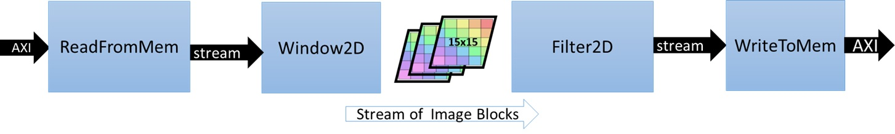

---
* This lab is to speed up the throughput of 2-D convolution filter.
* To analyze this lab, we can focus on three important speeds, throughput, input memory bandwidth and output memory bandwidth.


## Section I (Vitis_hls)
### Introduction

* The software code
``` c
void Filter2D(
        const char           coeffs[FILTER_V_SIZE][FILTER_H_SIZE],
        float                factor,
        short                bias,
        unsigned short       width,
        unsigned short       height,
        unsigned short       stride,
        const unsigned char *src,
        unsigned char       *dst)
{
    for(int y=0; y<height; ++y)
    {
        for(int x=0; x<width; ++x)
        {
            // Apply 2D filter to the pixel window
            int sum = 0;
            for(int row=0; row<FILTER_V_SIZE; row++)
            {
                for(int col=0; col<FILTER_H_SIZE; col++)
                {
                    unsigned char pixel;
                    int xoffset = (x+col-(FILTER_H_SIZE/2));
                    int yoffset = (y+row-(FILTER_V_SIZE/2));
                    // Deal with boundary conditions : clamp pixels to 0 when outside of image 
                    if ( (xoffset<0) || (xoffset>=width) || (yoffset<0) || (yoffset>=height) ) {
                        pixel = 0;
                    } else {
                        pixel = src[yoffset*stride+xoffset];
                    }
                    sum += pixel*coeffs[row][col];
                }
            }
            
            // Normalize and saturate result
            unsigned char outpix = MIN(MAX((int(factor * sum)+bias), 0), 255);

            // Write output
            dst[y*stride+x] = outpix;
        }
    }
}
```

* The bottleneck of memory (the kernel of 2D convolution is 15 x 15)
```
Memory Accesses to Read filter Co-efficients = 15x15 = 225
Memory Accesses to Read Neighbouring Pixels  = 15x15 = 225
Memory Accesses to Write to Output           = 1
Total Memory Accesses                       = 451 
```

* Simple calculation (Our target)
```
Video Resolution        = 1920 x 1080
Frame Width (pixels)    = 1920 
Frame Height (pixels)   = 1080 
Frame Rate(FPS)         = 60 
Pixel Depth(Bits)       = 8 
Color Channels(YUV)     = 3 
Throughput(Pixel/s)   = Frame Width * Frame Height * Channels * FPS
Throughput(Pixel/s)   = 1920*1080*3*60
Throughput (MB/s)     = 373 MB/s
```

### Kernel explaination
* The flow chart of hardware


* An approach to solving the memory bandwidth bottleneck


* Read
``` c
void ReadFromMem(
        unsigned short       width,
        unsigned short       height,
        unsigned short       stride,
        const char          *coeffs,
        hls::stream<char>   &coeff_stream,
        const unsigned char *src,
        hls::stream<U8>     &pixel_stream )
{
    assert(stride <= MAX_IMAGE_WIDTH);
    assert(height <= MAX_IMAGE_HEIGHT);
    assert(stride%64 == 0);

    unsigned num_coefs = FILTER_V_SIZE*FILTER_H_SIZE;
    unsigned num_coefs_padded = (((num_coefs-1)/64)+1)*64; // Make sure number of reads of multiple of 64, enables auto-widening
    read_coefs: for (int i=0; i<num_coefs_padded; i++) {
        U8 coef = coeffs[i];
        if (i<num_coefs) coeff_stream.write( coef );        
    }

    stride = (stride/64)*64; // Makes compiler see that stride is a multiple of 64, enables auto-widening
    unsigned offset = 0;
    unsigned x = 0;
    read_image: for (int n = 0; n < height*stride; n++) {
        U8 pix = src[n];
        if (x<width) pixel_stream.write( pix );
        if (x==(stride-1)) x=0; else x++;
     }
}
```

* Write
``` c
void WriteToMem(
        unsigned short       width,
        unsigned short       height,
        unsigned short       stride,
        hls::stream<U8>     &pixel_stream,
        unsigned char       *dst)
{
    assert(stride <= MAX_IMAGE_WIDTH);
    assert(height <= MAX_IMAGE_HEIGHT);
    assert(stride%64 == 0);

    stride = (stride/64)*64; // Makes compiler see that stride is a multiple of 64, enables auto-widening
    unsigned offset = 0;
    unsigned x = 0;
    write_image: for (int n = 0; n < height*stride; n++) {
        U8 pix = (x<width) ? pixel_stream.read() : 0;
        dst[n] = pix;
        if (x==(stride-1)) x=0; else x++;
    }    
}
```

* Local Buffer
``` c

```

* Kernel
``` c

```

### Errors you may encounter when running the testbench

* Undefined reference

``` 
/home/ubuntu/Desktop/HLS_project/LabB/Convolution_Filter_v1/solution1/csim/build/../../../hls_testbench.cpp:154: undefined reference to `Filter2D(char const (*) [15], float, short, unsigned short, unsigned short, unsigned short, unsigned char const*, unsigned char*)'
collect2: error: ld returned 1 exit status
```


* **Solution**

    Copy Filter2D from filter2d_sw.cpp to hls_testbench.cpp, and rename it as Filter2D_SW.


### C simulation results


### Synthesis Observations

## section II (Vitis)
### Step by step

* Step 1 import the kernel files


* Step 2 import the host files


* Step 3 configure the kernel function
**only add the top function!!!**


* Step 4 build kernels -> hw_link -> host -> system, respectively.
**remember it also needs to solve the undefined reference like in vitis_hls**

* Step 5 configure the run setting
**Make sure to add `-x` before `./binary_container_1.xclbin` to match the parser configuration:**

```
parser.addSwitch("--fpga",    "-x", "FPGA binary (xclbin) file to use");
```


**According the requirement, choose the runtime profiling setting.**


* Step 6 run and check the results


