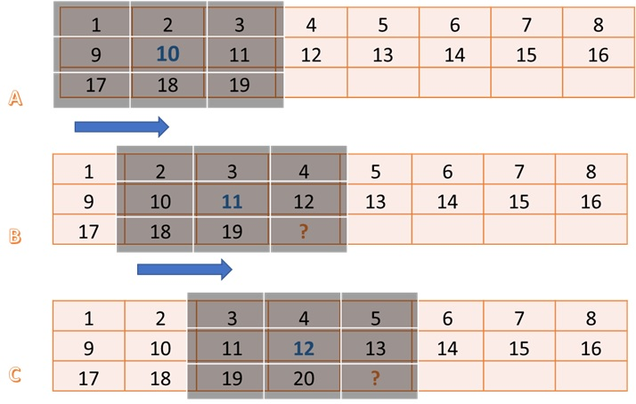

---
* This lab is to speed up the throughput of 2-D convolution filter.
* To analyze this lab, we can focus on three important speeds, throughput, input memory bandwidth and output memory bandwidth.


## Section I (Vitis_hls)
### Introduction

* The software code
``` c
void Filter2D(
        const char           coeffs[FILTER_V_SIZE][FILTER_H_SIZE],
        float                factor,
        short                bias,
        unsigned short       width,
        unsigned short       height,
        unsigned short       stride,
        const unsigned char *src,
        unsigned char       *dst)
{
    for(int y=0; y<height; ++y)
    {
        for(int x=0; x<width; ++x)
        {
            // Apply 2D filter to the pixel window
            int sum = 0;
            for(int row=0; row<FILTER_V_SIZE; row++)
            {
                for(int col=0; col<FILTER_H_SIZE; col++)
                {
                    unsigned char pixel;
                    int xoffset = (x+col-(FILTER_H_SIZE/2));
                    int yoffset = (y+row-(FILTER_V_SIZE/2));
                    // Deal with boundary conditions : clamp pixels to 0 when outside of image 
                    if ( (xoffset<0) || (xoffset>=width) || (yoffset<0) || (yoffset>=height) ) {
                        pixel = 0;
                    } else {
                        pixel = src[yoffset*stride+xoffset];
                    }
                    sum += pixel*coeffs[row][col];
                }
            }
            
            // Normalize and saturate result
            unsigned char outpix = MIN(MAX((int(factor * sum)+bias), 0), 255);

            // Write output
            dst[y*stride+x] = outpix;
        }
    }
}
```

* The bottleneck of memory (the kernel of 2D convolution is 15 x 15)
```
Memory Accesses to Read filter Co-efficients = 15x15 = 225
Memory Accesses to Read Neighbouring Pixels  = 15x15 = 225
Memory Accesses to Write to Output           = 1
Total Memory Accesses                       = 451 
```

* Simple calculation (Our target)
```
Video Resolution        = 1920 x 1080
Frame Width (pixels)    = 1920 
Frame Height (pixels)   = 1080 
Frame Rate(FPS)         = 60 
Pixel Depth(Bits)       = 8 
Color Channels(YUV)     = 3 
Throughput(Pixel/s)   = Frame Width * Frame Height * Channels * FPS
Throughput(Pixel/s)   = 1920*1080*3*60
Throughput (MB/s)     = 373 MB/s

Input (MB/s)          = 95.115 GB/s
```

### Kernel explaination
* The flow chart of hardware


* An approach to solving the memory bandwidth bottleneck


* Read
``` c
void ReadFromMem(
        unsigned short       width,
        unsigned short       height,
        unsigned short       stride,
        const char          *coeffs,
        hls::stream<char>   &coeff_stream,
        const unsigned char *src,
        hls::stream<U8>     &pixel_stream )
{
    assert(stride <= MAX_IMAGE_WIDTH);
    assert(height <= MAX_IMAGE_HEIGHT);
    assert(stride%64 == 0);

    unsigned num_coefs = FILTER_V_SIZE*FILTER_H_SIZE;
    unsigned num_coefs_padded = (((num_coefs-1)/64)+1)*64; // Make sure number of reads of multiple of 64, enables auto-widening
    read_coefs: for (int i=0; i<num_coefs_padded; i++) {
        U8 coef = coeffs[i];
        if (i<num_coefs) coeff_stream.write( coef );        
    }

    stride = (stride/64)*64; // Makes compiler see that stride is a multiple of 64, enables auto-widening
    unsigned offset = 0;
    unsigned x = 0;
    read_image: for (int n = 0; n < height*stride; n++) {
        U8 pix = src[n];
        if (x<width) pixel_stream.write( pix );
        if (x==(stride-1)) x=0; else x++;
     }
}
```

* Write
``` c
void WriteToMem(
        unsigned short       width,
        unsigned short       height,
        unsigned short       stride,
        hls::stream<U8>     &pixel_stream,
        unsigned char       *dst)
{
    assert(stride <= MAX_IMAGE_WIDTH);
    assert(height <= MAX_IMAGE_HEIGHT);
    assert(stride%64 == 0);

    stride = (stride/64)*64; // Makes compiler see that stride is a multiple of 64, enables auto-widening
    unsigned offset = 0;
    unsigned x = 0;
    write_image: for (int n = 0; n < height*stride; n++) {
        U8 pix = (x<width) ? pixel_stream.read() : 0;
        dst[n] = pix;
        if (x==(stride-1)) x=0; else x++;
    }    
}
```

* Local Buffer
``` c
struct window {
    U8 pix[FILTER_V_SIZE][FILTER_H_SIZE];
};


void Window2D(
        unsigned short        width,
        unsigned short        height,
        hls::stream<U8>      &pixel_stream,
        hls::stream<window>  &window_stream)
{
    // Line buffers - used to store [FILTER_V_SIZE-1] entire lines of pixels
    U8 LineBuffer[FILTER_V_SIZE-1][MAX_IMAGE_WIDTH];  
#pragma HLS ARRAY_PARTITION variable=LineBuffer dim=1 complete
#pragma HLS DEPENDENCE variable=LineBuffer inter false
#pragma HLS DEPENDENCE variable=LineBuffer intra false

    // Sliding window of [FILTER_V_SIZE][FILTER_H_SIZE] pixels
    window Window;

    unsigned col_ptr = 0;
    unsigned ramp_up = width*((FILTER_V_SIZE-1)/2)+(FILTER_H_SIZE-1)/2;
    unsigned num_pixels = width*height;
    unsigned num_iterations = num_pixels + ramp_up;

    const unsigned max_iterations = MAX_IMAGE_WIDTH*MAX_IMAGE_HEIGHT + MAX_IMAGE_WIDTH*((FILTER_V_SIZE-1)/2)+(FILTER_H_SIZE-1)/2;

    // Iterate until all pixels have been processed
    update_window: for (int n=0; n<num_iterations; n++)
    {
#pragma HLS LOOP_TRIPCOUNT max=max_iterations
#pragma HLS PIPELINE II=1

        // Read a new pixel from the input stream
        U8 new_pixel = (n<num_pixels) ? pixel_stream.read() : 0;

        // Shift the window and add a column of new pixels from the line buffer
        for(int i = 0; i < FILTER_V_SIZE; i++) {
            for(int j = 0; j < FILTER_H_SIZE-1; j++) {
                Window.pix[i][j] = Window.pix[i][j+1];
            }
            Window.pix[i][FILTER_H_SIZE-1] = (i<FILTER_V_SIZE-1) ? LineBuffer[i][col_ptr] : new_pixel;
        }

        // Shift pixels in the column of pixels in the line buffer, add the newest pixel
        for(int i = 0; i < FILTER_V_SIZE-2; i++) {
            LineBuffer[i][col_ptr] = LineBuffer[i+1][col_ptr];
        }
        LineBuffer[FILTER_V_SIZE-2][col_ptr] = new_pixel;

        // Update the line buffer column pointer
        if (col_ptr==(width-1)) {
            col_ptr = 0;
        } else {
            col_ptr++;
        }

        // Write output only when enough pixels have been read the buffers and ramped-up
        if (n>=ramp_up) {
            window_stream.write(Window);
        }

    }
}
```

* Kernel
``` c
void Filter2D(
        unsigned short       width,
        unsigned short       height,
        float                factor,
        short                bias,
        hls::stream<char>   &coeff_stream,
        hls::stream<window> &window_stream,
		hls::stream<U8>     &pixel_stream )
{
    assert(width  <= MAX_IMAGE_WIDTH);
    assert(height <= MAX_IMAGE_HEIGHT);

    // Filtering coefficients
    char coeffs[FILTER_V_SIZE][FILTER_H_SIZE];
#pragma HLS ARRAY_PARTITION variable=coeffs complete dim=0

    // Load the coefficients into local storage
    load_coefs: for (int i=0; i<FILTER_V_SIZE; i++) {
        for (int j=0; j<FILTER_H_SIZE; j++) {
#pragma HLS PIPELINE II=1
            coeffs[i][j] = coeff_stream.read();
        }
    }

    // Process the incoming stream of pixel windows
    apply_filter: for (int y = 0; y < height; y++) 
    {
        for (int x = 0; x < width; x++) 
        {
#pragma HLS PIPELINE II=1
            // Read a 2D window of pixels
            window w = window_stream.read();

            // Apply filter to the 2D window
            int sum = 0;
            for(int row=0; row<FILTER_V_SIZE; row++) 
            {
                for(int col=0; col<FILTER_H_SIZE; col++) 
                {
                    unsigned char pixel;
                    int xoffset = (x+col-(FILTER_H_SIZE/2));
                    int yoffset = (y+row-(FILTER_V_SIZE/2));
                    // Deal with boundary conditions : clamp pixels to 0 when outside of image 
                    if ( (xoffset<0) || (xoffset>=width) || (yoffset<0) || (yoffset>=height) ) {
                        pixel = 0;
                    } else {
                        pixel = w.pix[row][col];
                    }
                    sum += pixel*(char)coeffs[row][col];
                }
            }

            // Normalize result
            unsigned char outpix = MIN(MAX((int(factor * sum)+bias), 0), 255);

            // Write the output pixel
            pixel_stream.write(outpix);
        }
    }
}
```

* Top function
``` c
extern "C" {

void Filter2DKernel(
        const char           coeffs[256],
        float                factor,
        short                bias,
        unsigned short       width,
        unsigned short       height,
        unsigned short       stride,
        const unsigned char  src[MAX_IMAGE_WIDTH*MAX_IMAGE_HEIGHT],
        unsigned char        dst[MAX_IMAGE_WIDTH*MAX_IMAGE_HEIGHT])
  {
            
#pragma HLS DATAFLOW

	// Stream of pixels from kernel input to filter, and from filter to output
    hls::stream<char,2>    coefs_stream;
    hls::stream<U8,2>      pixel_stream;
    hls::stream<window,3>  window_stream; // Set FIFO depth to 0 to minimize resources
    hls::stream<U8,64>     output_stream;

	// Read image data from global memory over AXI4 MM, and stream pixels out
    ReadFromMem(width, height, stride, coeffs, coefs_stream, src, pixel_stream);

    // Read incoming pixels and form valid HxV windows
    Window2D(width, height, pixel_stream, window_stream);

	// Process incoming stream of pixels, and stream pixels out
	Filter2D(width, height, factor, bias, coefs_stream, window_stream, output_stream);

	// Write incoming stream of pixels and write them to global memory over AXI4 MM
	WriteToMem(width, height, stride, output_stream, dst);

  }

}
```

### Errors you may encounter when running the testbench

* Undefined reference

``` 
/home/ubuntu/Desktop/HLS_project/LabB/Convolution_Filter_v1/solution1/csim/build/../../../hls_testbench.cpp:154: undefined reference to `Filter2D(char const (*) [15], float, short, unsigned short, unsigned short, unsigned short, unsigned char const*, unsigned char*)'
collect2: error: ld returned 1 exit status
```


* **Solution**

    Copy Filter2D from filter2d_sw.cpp to hls_testbench.cpp, and rename it as Filter2D_SW.


### C simulation results


### Synthesis Observations

* Synthesis report


```


================================================================
== Synthesis Summary Report of 'Filter2DKernel'
================================================================
+ General Information: 
    * Date:           Wed Apr 30 06:27:13 2025
    * Version:        2022.1 (Build 3526262 on Mon Apr 18 15:47:01 MDT 2022)
    * Project:        Convolution_Filter_v1
    * Solution:       solution1 (Vivado IP Flow Target)
    * Product family: virtexuplus
    * Target device:  xcu50-fsvh2104-2-e
    

+ Performance & Resource Estimates: 
    
    PS: '+' for module; 'o' for loop; '*' for dataflow
    +-----------------------------------------------------+------+------+---------+-----------+----------+---------+---------+----------+----------+----------+-------------+------------+-----+
    |                       Modules                       | Issue|      | Latency |  Latency  | Iteration|         |   Trip  |          |          |          |             |            |     |
    |                       & Loops                       | Type | Slack| (cycles)|    (ns)   |  Latency | Interval|  Count  | Pipelined|   BRAM   |    DSP   |      FF     |     LUT    | URAM|
    +-----------------------------------------------------+------+------+---------+-----------+----------+---------+---------+----------+----------+----------+-------------+------------+-----+
    |+ Filter2DKernel*                                    |     -|  0.49|  2211025|  2.211e+07|         -|  2211026|        -|  dataflow|  14 (~0%)|  139 (2%)|  15478 (~0%)|  14559 (1%)|    -|
    | + ReadFromMem                                       |     -|  4.69|  2211025|  2.211e+07|         -|  2211025|        -|        no|         -|   1 (~0%)|    168 (~0%)|   425 (~0%)|    -|
    |  + ReadFromMem_Pipeline_read_coefs                  |     -|  5.31|      258|  2.580e+03|         -|      258|        -|        no|         -|         -|     13 (~0%)|    89 (~0%)|    -|
    |   o read_coefs                                      |     -|  7.30|      256|  2.560e+03|         2|        1|      256|       yes|         -|         -|            -|           -|    -|
    |  + ReadFromMem_Pipeline_read_image                  |     -|  4.69|  2210762|  2.211e+07|         -|  2210762|        -|        no|         -|         -|    107 (~0%)|   215 (~0%)|    -|
    |   o read_image                                      |     -|  7.30|  2210760|  2.211e+07|         2|        1|  2210760|       yes|         -|         -|            -|           -|    -|
    | + Window2D                                          |     -|  4.26|  2087054|  2.087e+07|         -|  2087054|        -|        no|  14 (~0%)|   1 (~0%)|   2110 (~0%)|   488 (~0%)|    -|
    |  + Window2D_Pipeline_update_window                  |     -|  4.26|  2087050|  2.087e+07|         -|  2087050|        -|        no|         -|         -|   1986 (~0%)|   289 (~0%)|    -|
    |   o update_window                                   |     -|  7.30|  2087048|  2.087e+07|         2|        1|  2087047|       yes|         -|         -|            -|           -|    -|
    | + entry_proc                                        |     -|  5.83|        0|      0.000|         -|        0|        -|        no|         -|         -|      3 (~0%)|    38 (~0%)|    -|
    | + Filter2D                                          |     -|  0.49|  2073847|  2.074e+07|         -|  2073847|        -|        no|         -|  136 (2%)|   9623 (~0%)|  11344 (1%)|    -|
    |  + Filter2D_Pipeline_load_coefs_VITIS_LOOP_146_1    |     -|  5.20|      227|  2.270e+03|         -|      227|        -|        no|         -|         -|   1827 (~0%)|   152 (~0%)|    -|
    |   o load_coefs_VITIS_LOOP_146_1                     |     -|  7.30|      225|  2.250e+03|         2|        1|      225|       yes|         -|         -|            -|           -|    -|
    |  + Filter2D_Pipeline_apply_filter_VITIS_LOOP_155_2  |     -|  0.49|  2073615|  2.074e+07|         -|  2073615|        -|        no|         -|  135 (2%)|   7695 (~0%)|  11063 (1%)|    -|
    |   o apply_filter_VITIS_LOOP_155_2                   |     -|  7.30|  2073613|  2.074e+07|        15|        1|  2073600|       yes|         -|         -|            -|           -|    -|
    | + WriteToMem                                        |     -|  4.31|  2210766|  2.211e+07|         -|  2210766|        -|        no|         -|   1 (~0%)|    202 (~0%)|   334 (~0%)|    -|
    |  + WriteToMem_Pipeline_write_image                  |     -|  4.31|  2210762|  2.211e+07|         -|  2210762|        -|        no|         -|         -|    146 (~0%)|   237 (~0%)|    -|
    |   o write_image                                     |     -|  7.30|  2210760|  2.211e+07|         2|        1|  2210760|       yes|         -|         -|            -|           -|    -|
    +-----------------------------------------------------+------+------+---------+-----------+----------+---------+---------+----------+----------+----------+-------------+------------+-----+


================================================================
== HW Interfaces
================================================================
* AP_MEMORY
+-----------------+----------+
| Interface       | Bitwidth |
+-----------------+----------+
| coeffs_address0 | 8        |
| coeffs_address1 | 8        |
| coeffs_d0       | 8        |
| coeffs_d1       | 8        |
| coeffs_q0       | 8        |
| coeffs_q1       | 8        |
| dst_address0    | 21       |
| dst_address1    | 21       |
| dst_d0          | 8        |
| dst_d1          | 8        |
| dst_q0          | 8        |
| dst_q1          | 8        |
| src_address0    | 21       |
| src_address1    | 21       |
| src_d0          | 8        |
| src_d1          | 8        |
| src_q0          | 8        |
| src_q1          | 8        |
+-----------------+----------+

* REGISTER
+-----------+---------+----------+
| Interface | Mode    | Bitwidth |
+-----------+---------+----------+
| bias      | ap_none | 16       |
| factor    | ap_none | 32       |
| height    | ap_none | 16       |
| stride    | ap_none | 16       |
| width     | ap_none | 16       |
+-----------+---------+----------+

* TOP LEVEL CONTROL
+-----------+------------+-----------------------------------+
| Interface | Type       | Ports                             |
+-----------+------------+-----------------------------------+
| ap_clk    | clock      | ap_clk                            |
| ap_rst    | reset      | ap_rst                            |
| ap_ctrl   | ap_ctrl_hs | ap_done ap_idle ap_ready ap_start |
+-----------+------------+-----------------------------------+


================================================================
== SW I/O Information
================================================================
* Top Function Arguments
+----------+-----------+-----------------------+
| Argument | Direction | Datatype              |
+----------+-----------+-----------------------+
| coeffs   | in        | char const *          |
| factor   | in        | float                 |
| bias     | in        | short                 |
| width    | in        | unsigned short        |
| height   | in        | unsigned short        |
| stride   | in        | unsigned short        |
| src      | in        | unsigned char const * |
| dst      | out       | unsigned char*        |
+----------+-----------+-----------------------+

* SW-to-HW Mapping
+----------+-----------------+---------+----------+
| Argument | HW Interface    | HW Type | HW Usage |
+----------+-----------------+---------+----------+
| coeffs   | coeffs_address0 | port    | offset   |
| coeffs   | coeffs_ce0      | port    |          |
| coeffs   | coeffs_d0       | port    |          |
| coeffs   | coeffs_q0       | port    |          |
| coeffs   | coeffs_we0      | port    |          |
| coeffs   | coeffs_address1 | port    | offset   |
| coeffs   | coeffs_ce1      | port    |          |
| coeffs   | coeffs_d1       | port    |          |
| coeffs   | coeffs_q1       | port    |          |
| coeffs   | coeffs_we1      | port    |          |
| factor   | factor          | port    |          |
| bias     | bias            | port    |          |
| width    | width           | port    |          |
| height   | height          | port    |          |
| stride   | stride          | port    |          |
| src      | src_address0    | port    | offset   |
| src      | src_ce0         | port    |          |
| src      | src_d0          | port    |          |
| src      | src_q0          | port    |          |
| src      | src_we0         | port    |          |
| src      | src_address1    | port    | offset   |
| src      | src_ce1         | port    |          |
| src      | src_d1          | port    |          |
| src      | src_q1          | port    |          |
| src      | src_we1         | port    |          |
| dst      | dst_address0    | port    | offset   |
| dst      | dst_ce0         | port    |          |
| dst      | dst_d0          | port    |          |
| dst      | dst_q0          | port    |          |
| dst      | dst_we0         | port    |          |
| dst      | dst_address1    | port    | offset   |
| dst      | dst_ce1         | port    |          |
| dst      | dst_d1          | port    |          |
| dst      | dst_q1          | port    |          |
| dst      | dst_we1         | port    |          |
+----------+-----------------+---------+----------+


================================================================
== Bind Op Report
================================================================
+-----------------------------------------------------+-----+--------+-----------------+------+--------+---------+
| Name                                                | DSP | Pragma | Variable        | Op   | Impl   | Latency |
+-----------------------------------------------------+-----+--------+-----------------+------+--------+---------+
| + Filter2DKernel                                    | 139 |        |                 |      |        |         |
|  + ReadFromMem                                      | 1   |        |                 |      |        |         |
|    mul_mul_16ns_11ns_22_4_1_U12                     | 1   |        | mul14           | mul  | dsp48  | 3       |
|    sub25_fu_152_p2                                  | -   |        | sub25           | add  | fabric | 0       |
|   + ReadFromMem_Pipeline_read_coefs                 | 0   |        |                 |      |        |         |
|     add_ln25_fu_81_p2                               | -   |        | add_ln25        | add  | fabric | 0       |
|   + ReadFromMem_Pipeline_read_image                 | 0   |        |                 |      |        |         |
|     add_ln33_fu_123_p2                              | -   |        | add_ln33        | add  | fabric | 0       |
|     x_fu_150_p2                                     | -   |        | x               | add  | fabric | 0       |
|  + Window2D                                         | 1   |        |                 |      |        |         |
|    mul_mul_16ns_16ns_32_4_1_U44                     | 1   |        | num_pixels      | mul  | dsp48  | 3       |
|    num_iterations_fu_202_p2                         | -   |        | num_iterations  | add  | fabric | 0       |
|    sub_fu_208_p2                                    | -   |        | sub             | add  | fabric | 0       |
|   + Window2D_Pipeline_update_window                 | 0   |        |                 |      |        |         |
|     n_3_fu_1255_p2                                  | -   |        | n_3             | add  | fabric | 0       |
|     col_ptr_1_fu_1292_p2                            | -   |        | col_ptr_1       | add  | fabric | 0       |
|  + Filter2D                                         | 136 |        |                 |      |        |         |
|    mul_mul_11ns_11ns_22_4_1_U751                    | 1   |        | bound4          | mul  | dsp48  | 3       |
|   + Filter2D_Pipeline_load_coefs_VITIS_LOOP_146_1   | 0   |        |                 |      |        |         |
|     add_ln145_fu_3033_p2                            | -   |        | add_ln145       | add  | fabric | 0       |
|     add_ln145_1_fu_3059_p2                          | -   |        | add_ln145_1     | add  | fabric | 0       |
|     add_ln146_fu_3073_p2                            | -   |        | add_ln146       | add  | fabric | 0       |
|   + Filter2D_Pipeline_apply_filter_VITIS_LOOP_155_2 | 135 |        |                 |      |        |         |
|     y_4_fu_3862_p2                                  | -   |        | y_4             | add  | fabric | 0       |
|     yoffset_fu_3868_p2                              | -   |        | yoffset         | add  | fabric | 0       |
|     yoffset_1_fu_3874_p2                            | -   |        | yoffset_1       | add  | fabric | 0       |
|     yoffset_2_fu_3880_p2                            | -   |        | yoffset_2       | add  | fabric | 0       |
|     yoffset_3_fu_3886_p2                            | -   |        | yoffset_3       | add  | fabric | 0       |
|     yoffset_4_fu_3892_p2                            | -   |        | yoffset_4       | add  | fabric | 0       |
|     yoffset_5_fu_3898_p2                            | -   |        | yoffset_5       | add  | fabric | 0       |
|     yoffset_6_fu_3904_p2                            | -   |        | yoffset_6       | add  | fabric | 0       |
|     yoffset_9_fu_3910_p2                            | -   |        | yoffset_9       | add  | fabric | 0       |
|     yoffset_10_fu_3916_p2                           | -   |        | yoffset_10      | add  | fabric | 0       |
|     yoffset_11_fu_3922_p2                           | -   |        | yoffset_11      | add  | fabric | 0       |
|     yoffset_12_fu_3928_p2                           | -   |        | yoffset_12      | add  | fabric | 0       |
|     yoffset_13_fu_3934_p2                           | -   |        | yoffset_13      | add  | fabric | 0       |
|     yoffset_14_fu_3940_p2                           | -   |        | yoffset_14      | add  | fabric | 0       |
|     add_ln153_fu_3844_p2                            | -   |        | add_ln153       | add  | fabric | 0       |
|     yoffset_mid1_fu_4120_p2                         | -   |        | yoffset_mid1    | add  | fabric | 0       |
|     yoffset_1_mid1_fu_4126_p2                       | -   |        | yoffset_1_mid1  | add  | fabric | 0       |
|     yoffset_2_mid1_fu_4132_p2                       | -   |        | yoffset_2_mid1  | add  | fabric | 0       |
|     yoffset_3_mid1_fu_4138_p2                       | -   |        | yoffset_3_mid1  | add  | fabric | 0       |
|     yoffset_4_mid1_fu_4144_p2                       | -   |        | yoffset_4_mid1  | add  | fabric | 0       |
|     yoffset_5_mid1_fu_4150_p2                       | -   |        | yoffset_5_mid1  | add  | fabric | 0       |
|     yoffset_6_mid1_fu_4156_p2                       | -   |        | yoffset_6_mid1  | add  | fabric | 0       |
|     yoffset_14_mid1_fu_4162_p2                      | -   |        | yoffset_14_mid1 | add  | fabric | 0       |
|     xoffset_fu_6624_p2                              | -   |        | xoffset         | add  | fabric | 0       |
|     mul_8ns_8s_16_1_1_U281                          | -   |        | sum             | mul  | auto   | 0       |
|     xoffset_27_fu_6655_p2                           | -   |        | xoffset_27      | add  | fabric | 0       |
|     xoffset_8_fu_6661_p2                            | -   |        | xoffset_8       | add  | fabric | 0       |
|     mac_muladd_8ns_8s_16s_17_4_1_U374               | 1   |        | mul_ln176       | mul  | dsp48  | 3       |
|     xoffset_15_fu_6696_p2                           | -   |        | xoffset_15      | add  | fabric | 0       |
|     mul_8ns_8s_16_1_1_U282                          | -   |        | mul_ln176_1     | mul  | auto   | 0       |
|     xoffset_16_fu_6727_p2                           | -   |        | xoffset_16      | add  | fabric | 0       |
|     mac_muladd_8ns_8s_16s_17_4_1_U375               | 1   |        | mul_ln176_2     | mul  | dsp48  | 3       |
|     xoffset_17_fu_6762_p2                           | -   |        | xoffset_17      | add  | fabric | 0       |
|     mac_muladd_8ns_8s_18s_19_4_1_U467               | 1   |        | mul_ln176_3     | mul  | dsp48  | 3       |
|     xoffset_18_fu_6793_p2                           | -   |        | xoffset_18      | add  | fabric | 0       |
|     mac_muladd_8ns_8s_17s_18_4_1_U468               | 1   |        | mul_ln176_4     | mul  | dsp48  | 3       |
|     xoffset_19_fu_6824_p2                           | -   |        | xoffset_19      | add  | fabric | 0       |
|     mul_8ns_8s_16_1_1_U283                          | -   |        | mul_ln176_5     | mul  | auto   | 0       |
|     mac_muladd_8ns_8s_16s_17_4_1_U376               | 1   |        | mul_ln176_6     | mul  | dsp48  | 3       |
|     mac_muladd_8ns_8s_19s_20_4_1_U502               | 1   |        | mul_ln176_7     | mul  | dsp48  | 3       |
|     xoffset_21_fu_6892_p2                           | -   |        | xoffset_21      | add  | fabric | 0       |
|     mul_8ns_8s_16_1_1_U284                          | -   |        | mul_ln176_8     | mul  | auto   | 0       |
|     xoffset_22_fu_6923_p2                           | -   |        | xoffset_22      | add  | fabric | 0       |
|     mac_muladd_8ns_8s_16s_17_4_1_U377               | 1   |        | mul_ln176_9     | mul  | dsp48  | 3       |
|     xoffset_23_fu_6958_p2                           | -   |        | xoffset_23      | add  | fabric | 0       |
|     mul_8ns_8s_16_1_1_U285                          | -   |        | mul_ln176_10    | mul  | auto   | 0       |
|     xoffset_24_fu_6989_p2                           | -   |        | xoffset_24      | add  | fabric | 0       |
|     mac_muladd_8ns_8s_16s_17_4_1_U378               | 1   |        | mul_ln176_11    | mul  | dsp48  | 3       |
|     xoffset_25_fu_7024_p2                           | -   |        | xoffset_25      | add  | fabric | 0       |
|     mac_muladd_8ns_8s_17s_18_4_1_U469               | 1   |        | mul_ln176_12    | mul  | dsp48  | 3       |
|     xoffset_26_fu_7055_p2                           | -   |        | xoffset_26      | add  | fabric | 0       |
|     mul_8ns_8s_16_1_1_U286                          | -   |        | mul_ln176_13    | mul  | auto   | 0       |
|     mac_muladd_8ns_8s_16s_17_4_1_U379               | 1   |        | mul_ln176_14    | mul  | dsp48  | 3       |
|     mac_muladd_8ns_8s_20s_21_4_1_U503               | 1   |        | mul_ln176_15    | mul  | dsp48  | 3       |
|     mul_8ns_8s_16_1_1_U287                          | -   |        | mul_ln176_16    | mul  | auto   | 0       |
|     mac_muladd_8ns_8s_16s_17_4_1_U380               | 1   |        | mul_ln176_17    | mul  | dsp48  | 3       |
|     mul_8ns_8s_16_1_1_U288                          | -   |        | mul_ln176_18    | mul  | auto   | 0       |
|     mac_muladd_8ns_8s_16s_17_4_1_U381               | 1   |        | mul_ln176_19    | mul  | dsp48  | 3       |
|     mul_8ns_8s_16_1_1_U289                          | -   |        | mul_ln176_20    | mul  | auto   | 0       |
|     mac_muladd_8ns_8s_16s_17_4_1_U382               | 1   |        | mul_ln176_21    | mul  | dsp48  | 3       |
|     mul_8ns_8s_16_1_1_U290                          | -   |        | mul_ln176_22    | mul  | auto   | 0       |
|     mac_muladd_8ns_8s_16s_17_4_1_U383               | 1   |        | mul_ln176_23    | mul  | dsp48  | 3       |
|     mul_8ns_8s_16_1_1_U291                          | -   |        | mul_ln176_24    | mul  | auto   | 0       |
|     mac_muladd_8ns_8s_16s_17_4_1_U384               | 1   |        | mul_ln176_25    | mul  | dsp48  | 3       |
|     mul_8ns_8s_16_1_1_U292                          | -   |        | mul_ln176_26    | mul  | auto   | 0       |
|     mac_muladd_8ns_8s_16s_17_4_1_U385               | 1   |        | mul_ln176_27    | mul  | dsp48  | 3       |
|     mac_muladd_8ns_8s_17s_18_4_1_U470               | 1   |        | mul_ln176_28    | mul  | dsp48  | 3       |
|     mul_8ns_8s_16_1_1_U293                          | -   |        | mul_ln176_29    | mul  | auto   | 0       |
|     mac_muladd_8ns_8s_16s_17_4_1_U386               | 1   |        | mul_ln176_30    | mul  | dsp48  | 3       |
|     mac_muladd_8ns_8s_21s_22_4_1_U504               | 1   |        | mul_ln176_31    | mul  | dsp48  | 3       |
|     mul_8ns_8s_16_1_1_U294                          | -   |        | mul_ln176_32    | mul  | auto   | 0       |
|     mac_muladd_8ns_8s_16s_17_4_1_U387               | 1   |        | mul_ln176_33    | mul  | dsp48  | 3       |
|     mul_8ns_8s_16_1_1_U295                          | -   |        | mul_ln176_34    | mul  | auto   | 0       |
|     mac_muladd_8ns_8s_16s_17_4_1_U388               | 1   |        | mul_ln176_35    | mul  | dsp48  | 3       |
|     mul_8ns_8s_16_1_1_U296                          | -   |        | mul_ln176_36    | mul  | auto   | 0       |
|     mac_muladd_8ns_8s_16s_17_4_1_U389               | 1   |        | mul_ln176_37    | mul  | dsp48  | 3       |
|     mul_8ns_8s_16_1_1_U297                          | -   |        | mul_ln176_38    | mul  | auto   | 0       |
|     mac_muladd_8ns_8s_16s_17_4_1_U390               | 1   |        | mul_ln176_39    | mul  | dsp48  | 3       |
|     mul_8ns_8s_16_1_1_U298                          | -   |        | mul_ln176_40    | mul  | auto   | 0       |
|     mac_muladd_8ns_8s_16s_17_4_1_U391               | 1   |        | mul_ln176_41    | mul  | dsp48  | 3       |
|     mul_8ns_8s_16_1_1_U299                          | -   |        | mul_ln176_42    | mul  | auto   | 0       |
|     mac_muladd_8ns_8s_16s_17_4_1_U392               | 1   |        | mul_ln176_43    | mul  | dsp48  | 3       |
|     mul_8ns_8s_16_1_1_U300                          | -   |        | mul_ln176_44    | mul  | auto   | 0       |
|     mac_muladd_8ns_8s_16s_17_4_1_U393               | 1   |        | mul_ln176_45    | mul  | dsp48  | 3       |
|     mul_8ns_8s_16_1_1_U301                          | -   |        | mul_ln176_46    | mul  | auto   | 0       |
|     mac_muladd_8ns_8s_16s_17_4_1_U394               | 1   |        | mul_ln176_47    | mul  | dsp48  | 3       |
|     mul_8ns_8s_16_1_1_U302                          | -   |        | mul_ln176_48    | mul  | auto   | 0       |
|     mac_muladd_8ns_8s_16s_17_4_1_U395               | 1   |        | mul_ln176_49    | mul  | dsp48  | 3       |
|     mul_8ns_8s_16_1_1_U303                          | -   |        | mul_ln176_50    | mul  | auto   | 0       |
|     mac_muladd_8ns_8s_16s_17_4_1_U396               | 1   |        | mul_ln176_51    | mul  | dsp48  | 3       |
|     mul_8ns_8s_16_1_1_U304                          | -   |        | mul_ln176_52    | mul  | auto   | 0       |
|     mac_muladd_8ns_8s_16s_17_4_1_U397               | 1   |        | mul_ln176_53    | mul  | dsp48  | 3       |
|     mul_8ns_8s_16_1_1_U305                          | -   |        | mul_ln176_54    | mul  | auto   | 0       |
|     mac_muladd_8ns_8s_16s_17_4_1_U398               | 1   |        | mul_ln176_55    | mul  | dsp48  | 3       |
|     mul_8ns_8s_16_1_1_U306                          | -   |        | mul_ln176_56    | mul  | auto   | 0       |
|     mac_muladd_8ns_8s_16s_17_4_1_U399               | 1   |        | mul_ln176_57    | mul  | dsp48  | 3       |
|     mul_8ns_8s_16_1_1_U307                          | -   |        | mul_ln176_58    | mul  | auto   | 0       |
|     mac_muladd_8ns_8s_16s_17_4_1_U400               | 1   |        | mul_ln176_59    | mul  | dsp48  | 3       |
|     mac_muladd_8ns_8s_17s_18_4_1_U471               | 1   |        | mul_ln176_60    | mul  | dsp48  | 3       |
|     mul_8ns_8s_16_1_1_U308                          | -   |        | mul_ln176_61    | mul  | auto   | 0       |
|     mac_muladd_8ns_8s_16s_17_4_1_U401               | 1   |        | mul_ln176_62    | mul  | dsp48  | 3       |
|     mac_muladd_8ns_8s_22s_23_4_1_U505               | 1   |        | mul_ln176_63    | mul  | dsp48  | 3       |
|     mul_8ns_8s_16_1_1_U309                          | -   |        | mul_ln176_64    | mul  | auto   | 0       |
|     mac_muladd_8ns_8s_16s_17_4_1_U402               | 1   |        | mul_ln176_65    | mul  | dsp48  | 3       |
|     mul_8ns_8s_16_1_1_U310                          | -   |        | mul_ln176_66    | mul  | auto   | 0       |
|     mac_muladd_8ns_8s_16s_17_4_1_U403               | 1   |        | mul_ln176_67    | mul  | dsp48  | 3       |
|     mul_8ns_8s_16_1_1_U311                          | -   |        | mul_ln176_68    | mul  | auto   | 0       |
|     mac_muladd_8ns_8s_16s_17_4_1_U404               | 1   |        | mul_ln176_69    | mul  | dsp48  | 3       |
|     mul_8ns_8s_16_1_1_U312                          | -   |        | mul_ln176_70    | mul  | auto   | 0       |
|     mac_muladd_8ns_8s_16s_17_4_1_U405               | 1   |        | mul_ln176_71    | mul  | dsp48  | 3       |
|     mul_8ns_8s_16_1_1_U313                          | -   |        | mul_ln176_72    | mul  | auto   | 0       |
|     mac_muladd_8ns_8s_16s_17_4_1_U406               | 1   |        | mul_ln176_73    | mul  | dsp48  | 3       |
|     mul_8ns_8s_16_1_1_U314                          | -   |        | mul_ln176_74    | mul  | auto   | 0       |
|     mac_muladd_8ns_8s_16s_17_4_1_U407               | 1   |        | mul_ln176_75    | mul  | dsp48  | 3       |
|     mul_8ns_8s_16_1_1_U315                          | -   |        | mul_ln176_76    | mul  | auto   | 0       |
|     mac_muladd_8ns_8s_16s_17_4_1_U408               | 1   |        | mul_ln176_77    | mul  | dsp48  | 3       |
|     mul_8ns_8s_16_1_1_U316                          | -   |        | mul_ln176_78    | mul  | auto   | 0       |
|     mac_muladd_8ns_8s_16s_17_4_1_U409               | 1   |        | mul_ln176_79    | mul  | dsp48  | 3       |
|     mul_8ns_8s_16_1_1_U317                          | -   |        | mul_ln176_80    | mul  | auto   | 0       |
|     mac_muladd_8ns_8s_16s_17_4_1_U410               | 1   |        | mul_ln176_81    | mul  | dsp48  | 3       |
|     mul_8ns_8s_16_1_1_U318                          | -   |        | mul_ln176_82    | mul  | auto   | 0       |
|     mac_muladd_8ns_8s_16s_17_4_1_U411               | 1   |        | mul_ln176_83    | mul  | dsp48  | 3       |
|     mul_8ns_8s_16_1_1_U319                          | -   |        | mul_ln176_84    | mul  | auto   | 0       |
|     mac_muladd_8ns_8s_16s_17_4_1_U412               | 1   |        | mul_ln176_85    | mul  | dsp48  | 3       |
|     mul_8ns_8s_16_1_1_U320                          | -   |        | mul_ln176_86    | mul  | auto   | 0       |
|     mac_muladd_8ns_8s_16s_17_4_1_U413               | 1   |        | mul_ln176_87    | mul  | dsp48  | 3       |
|     mul_8ns_8s_16_1_1_U321                          | -   |        | mul_ln176_88    | mul  | auto   | 0       |
|     mac_muladd_8ns_8s_16s_17_4_1_U414               | 1   |        | mul_ln176_89    | mul  | dsp48  | 3       |
|     mul_8ns_8s_16_1_1_U322                          | -   |        | mul_ln176_90    | mul  | auto   | 0       |
|     mac_muladd_8ns_8s_16s_17_4_1_U415               | 1   |        | mul_ln176_91    | mul  | dsp48  | 3       |
|     mul_8ns_8s_16_1_1_U323                          | -   |        | mul_ln176_92    | mul  | auto   | 0       |
|     mac_muladd_8ns_8s_16s_17_4_1_U416               | 1   |        | mul_ln176_93    | mul  | dsp48  | 3       |
|     mul_8ns_8s_16_1_1_U324                          | -   |        | mul_ln176_94    | mul  | auto   | 0       |
|     mac_muladd_8ns_8s_16s_17_4_1_U417               | 1   |        | mul_ln176_95    | mul  | dsp48  | 3       |
|     mul_8ns_8s_16_1_1_U325                          | -   |        | mul_ln176_96    | mul  | auto   | 0       |
|     mac_muladd_8ns_8s_16s_17_4_1_U418               | 1   |        | mul_ln176_97    | mul  | dsp48  | 3       |
|     mul_8ns_8s_16_1_1_U326                          | -   |        | mul_ln176_98    | mul  | auto   | 0       |
|     mac_muladd_8ns_8s_16s_17_4_1_U419               | 1   |        | mul_ln176_99    | mul  | dsp48  | 3       |
|     mul_8ns_8s_16_1_1_U327                          | -   |        | mul_ln176_100   | mul  | auto   | 0       |
|     mac_muladd_8ns_8s_16s_17_4_1_U420               | 1   |        | mul_ln176_101   | mul  | dsp48  | 3       |
|     mul_8ns_8s_16_1_1_U328                          | -   |        | mul_ln176_102   | mul  | auto   | 0       |
|     mac_muladd_8ns_8s_16s_17_4_1_U421               | 1   |        | mul_ln176_103   | mul  | dsp48  | 3       |
|     mul_8ns_8s_16_1_1_U329                          | -   |        | mul_ln176_104   | mul  | auto   | 0       |
|     mac_muladd_8ns_8s_16s_17_4_1_U422               | 1   |        | mul_ln176_105   | mul  | dsp48  | 3       |
|     mul_8ns_8s_16_1_1_U330                          | -   |        | mul_ln176_106   | mul  | auto   | 0       |
|     mac_muladd_8ns_8s_16s_17_4_1_U423               | 1   |        | mul_ln176_107   | mul  | dsp48  | 3       |
|     mul_8ns_8s_16_1_1_U331                          | -   |        | mul_ln176_108   | mul  | auto   | 0       |
|     mac_muladd_8ns_8s_16s_17_4_1_U424               | 1   |        | mul_ln176_109   | mul  | dsp48  | 3       |
|     mul_8ns_8s_16_1_1_U332                          | -   |        | mul_ln176_110   | mul  | auto   | 0       |
|     mac_muladd_8ns_8s_16s_17_4_1_U425               | 1   |        | mul_ln176_111   | mul  | dsp48  | 3       |
|     mul_8ns_8s_16_1_1_U333                          | -   |        | mul_ln176_112   | mul  | auto   | 0       |
|     mac_muladd_8ns_8s_16s_17_4_1_U426               | 1   |        | mul_ln176_113   | mul  | dsp48  | 3       |
|     mul_8ns_8s_16_1_1_U334                          | -   |        | mul_ln176_114   | mul  | auto   | 0       |
|     mac_muladd_8ns_8s_16s_17_4_1_U427               | 1   |        | mul_ln176_115   | mul  | dsp48  | 3       |
|     mul_8ns_8s_16_1_1_U335                          | -   |        | mul_ln176_116   | mul  | auto   | 0       |
|     mac_muladd_8ns_8s_16s_17_4_1_U428               | 1   |        | mul_ln176_117   | mul  | dsp48  | 3       |
|     mul_8ns_8s_16_1_1_U336                          | -   |        | mul_ln176_118   | mul  | auto   | 0       |
|     mac_muladd_8ns_8s_16s_17_4_1_U429               | 1   |        | mul_ln176_119   | mul  | dsp48  | 3       |
|     mul_8ns_8s_16_1_1_U337                          | -   |        | mul_ln176_120   | mul  | auto   | 0       |
|     mac_muladd_8ns_8s_16s_17_4_1_U430               | 1   |        | mul_ln176_121   | mul  | dsp48  | 3       |
|     mul_8ns_8s_16_1_1_U338                          | -   |        | mul_ln176_122   | mul  | auto   | 0       |
|     mac_muladd_8ns_8s_16s_17_4_1_U431               | 1   |        | mul_ln176_123   | mul  | dsp48  | 3       |
|     mac_muladd_8ns_8s_17s_18_4_1_U472               | 1   |        | mul_ln176_124   | mul  | dsp48  | 3       |
|     mul_8ns_8s_16_1_1_U339                          | -   |        | mul_ln176_125   | mul  | auto   | 0       |
|     mac_muladd_8ns_8s_16s_17_4_1_U432               | 1   |        | mul_ln176_126   | mul  | dsp48  | 3       |
|     mul_8ns_8s_16_1_1_U340                          | -   |        | mul_ln176_127   | mul  | auto   | 0       |
|     mac_muladd_8ns_8s_16s_17_4_1_U433               | 1   |        | mul_ln176_128   | mul  | dsp48  | 3       |
|     mac_muladd_8ns_8s_17s_18_4_1_U473               | 1   |        | mul_ln176_129   | mul  | dsp48  | 3       |
|     mul_8ns_8s_16_1_1_U341                          | -   |        | mul_ln176_130   | mul  | auto   | 0       |
|     mac_muladd_8ns_8s_16s_17_4_1_U434               | 1   |        | mul_ln176_131   | mul  | dsp48  | 3       |
|     mac_muladd_8ns_8s_17s_18_4_1_U474               | 1   |        | mul_ln176_132   | mul  | dsp48  | 3       |
|     mul_8ns_8s_16_1_1_U342                          | -   |        | mul_ln176_133   | mul  | auto   | 0       |
|     mac_muladd_8ns_8s_16s_17_4_1_U435               | 1   |        | mul_ln176_134   | mul  | dsp48  | 3       |
|     mac_muladd_8ns_8s_17s_18_4_1_U475               | 1   |        | mul_ln176_135   | mul  | dsp48  | 3       |
|     mul_8ns_8s_16_1_1_U343                          | -   |        | mul_ln176_136   | mul  | auto   | 0       |
|     mac_muladd_8ns_8s_16s_17_4_1_U436               | 1   |        | mul_ln176_137   | mul  | dsp48  | 3       |
|     mac_muladd_8ns_8s_17s_18_4_1_U476               | 1   |        | mul_ln176_138   | mul  | dsp48  | 3       |
|     mul_8ns_8s_16_1_1_U344                          | -   |        | mul_ln176_139   | mul  | auto   | 0       |
|     mac_muladd_8ns_8s_16s_17_4_1_U437               | 1   |        | mul_ln176_140   | mul  | dsp48  | 3       |
|     mac_muladd_8ns_8s_17s_18_4_1_U477               | 1   |        | mul_ln176_141   | mul  | dsp48  | 3       |
|     mul_8ns_8s_16_1_1_U345                          | -   |        | mul_ln176_142   | mul  | auto   | 0       |
|     mac_muladd_8ns_8s_16s_17_4_1_U438               | 1   |        | mul_ln176_143   | mul  | dsp48  | 3       |
|     mac_muladd_8ns_8s_17s_18_4_1_U478               | 1   |        | mul_ln176_144   | mul  | dsp48  | 3       |
|     mul_8ns_8s_16_1_1_U346                          | -   |        | mul_ln176_145   | mul  | auto   | 0       |
|     mac_muladd_8ns_8s_16s_17_4_1_U439               | 1   |        | mul_ln176_146   | mul  | dsp48  | 3       |
|     mac_muladd_8ns_8s_17s_18_4_1_U479               | 1   |        | mul_ln176_147   | mul  | dsp48  | 3       |
|     mul_8ns_8s_16_1_1_U347                          | -   |        | mul_ln176_148   | mul  | auto   | 0       |
|     mac_muladd_8ns_8s_16s_17_4_1_U440               | 1   |        | mul_ln176_149   | mul  | dsp48  | 3       |
|     mac_muladd_8ns_8s_17s_18_4_1_U480               | 1   |        | mul_ln176_150   | mul  | dsp48  | 3       |
|     mul_8ns_8s_16_1_1_U348                          | -   |        | mul_ln176_151   | mul  | auto   | 0       |
|     mac_muladd_8ns_8s_16s_17_4_1_U441               | 1   |        | mul_ln176_152   | mul  | dsp48  | 3       |
|     mac_muladd_8ns_8s_17s_18_4_1_U481               | 1   |        | mul_ln176_153   | mul  | dsp48  | 3       |
|     mul_8ns_8s_16_1_1_U349                          | -   |        | mul_ln176_154   | mul  | auto   | 0       |
|     mac_muladd_8ns_8s_16s_17_4_1_U442               | 1   |        | mul_ln176_155   | mul  | dsp48  | 3       |
|     mac_muladd_8ns_8s_17s_18_4_1_U482               | 1   |        | mul_ln176_156   | mul  | dsp48  | 3       |
|     mul_8ns_8s_16_1_1_U350                          | -   |        | mul_ln176_157   | mul  | auto   | 0       |
|     mac_muladd_8ns_8s_16s_17_4_1_U443               | 1   |        | mul_ln176_158   | mul  | dsp48  | 3       |
|     mac_muladd_8ns_8s_17s_18_4_1_U483               | 1   |        | mul_ln176_159   | mul  | dsp48  | 3       |
|     mul_8ns_8s_16_1_1_U351                          | -   |        | mul_ln176_160   | mul  | auto   | 0       |
|     mac_muladd_8ns_8s_16s_17_4_1_U444               | 1   |        | mul_ln176_161   | mul  | dsp48  | 3       |
|     mac_muladd_8ns_8s_17s_18_4_1_U484               | 1   |        | mul_ln176_162   | mul  | dsp48  | 3       |
|     mul_8ns_8s_16_1_1_U352                          | -   |        | mul_ln176_163   | mul  | auto   | 0       |
|     mac_muladd_8ns_8s_16s_17_4_1_U445               | 1   |        | mul_ln176_164   | mul  | dsp48  | 3       |
|     mac_muladd_8ns_8s_17s_18_4_1_U485               | 1   |        | mul_ln176_165   | mul  | dsp48  | 3       |
|     mul_8ns_8s_16_1_1_U353                          | -   |        | mul_ln176_166   | mul  | auto   | 0       |
|     mac_muladd_8ns_8s_16s_17_4_1_U446               | 1   |        | mul_ln176_167   | mul  | dsp48  | 3       |
|     mac_muladd_8ns_8s_17s_18_4_1_U486               | 1   |        | mul_ln176_168   | mul  | dsp48  | 3       |
|     mul_8ns_8s_16_1_1_U354                          | -   |        | mul_ln176_169   | mul  | auto   | 0       |
|     mac_muladd_8ns_8s_16s_17_4_1_U447               | 1   |        | mul_ln176_170   | mul  | dsp48  | 3       |
|     mul_8ns_8s_16_1_1_U355                          | -   |        | mul_ln176_171   | mul  | auto   | 0       |
|     mac_muladd_8ns_8s_16s_17_4_1_U448               | 1   |        | mul_ln176_172   | mul  | dsp48  | 3       |
|     mul_8ns_8s_16_1_1_U356                          | -   |        | mul_ln176_173   | mul  | auto   | 0       |
|     mac_muladd_8ns_8s_16s_17_4_1_U449               | 1   |        | mul_ln176_174   | mul  | dsp48  | 3       |
|     mac_muladd_8ns_8s_17s_18_4_1_U487               | 1   |        | mul_ln176_175   | mul  | dsp48  | 3       |
|     mul_8ns_8s_16_1_1_U357                          | -   |        | mul_ln176_176   | mul  | auto   | 0       |
|     mac_muladd_8ns_8s_16s_17_4_1_U450               | 1   |        | mul_ln176_177   | mul  | dsp48  | 3       |
|     mac_muladd_8ns_8s_17s_18_4_1_U488               | 1   |        | mul_ln176_178   | mul  | dsp48  | 3       |
|     mul_8ns_8s_16_1_1_U358                          | -   |        | mul_ln176_179   | mul  | auto   | 0       |
|     mac_muladd_8ns_8s_16s_17_4_1_U451               | 1   |        | mul_ln176_180   | mul  | dsp48  | 3       |
|     mac_muladd_8ns_8s_17s_18_4_1_U489               | 1   |        | mul_ln176_181   | mul  | dsp48  | 3       |
|     mul_8ns_8s_16_1_1_U359                          | -   |        | mul_ln176_182   | mul  | auto   | 0       |
|     mac_muladd_8ns_8s_16s_17_4_1_U452               | 1   |        | mul_ln176_183   | mul  | dsp48  | 3       |
|     mac_muladd_8ns_8s_17s_18_4_1_U490               | 1   |        | mul_ln176_184   | mul  | dsp48  | 3       |
|     mul_8ns_8s_16_1_1_U360                          | -   |        | mul_ln176_185   | mul  | auto   | 0       |
|     mac_muladd_8ns_8s_16s_17_4_1_U453               | 1   |        | mul_ln176_186   | mul  | dsp48  | 3       |
|     mac_muladd_8ns_8s_17s_18_4_1_U491               | 1   |        | mul_ln176_187   | mul  | dsp48  | 3       |
|     mul_8ns_8s_16_1_1_U361                          | -   |        | mul_ln176_188   | mul  | auto   | 0       |
|     mac_muladd_8ns_8s_16s_17_4_1_U454               | 1   |        | mul_ln176_189   | mul  | dsp48  | 3       |
|     mac_muladd_8ns_8s_17s_18_4_1_U492               | 1   |        | mul_ln176_190   | mul  | dsp48  | 3       |
|     mul_8ns_8s_16_1_1_U362                          | -   |        | mul_ln176_191   | mul  | auto   | 0       |
|     mac_muladd_8ns_8s_16s_17_4_1_U455               | 1   |        | mul_ln176_192   | mul  | dsp48  | 3       |
|     mac_muladd_8ns_8s_17s_18_4_1_U493               | 1   |        | mul_ln176_193   | mul  | dsp48  | 3       |
|     mul_8ns_8s_16_1_1_U363                          | -   |        | mul_ln176_194   | mul  | auto   | 0       |
|     mac_muladd_8ns_8s_16s_17_4_1_U456               | 1   |        | mul_ln176_195   | mul  | dsp48  | 3       |
|     mac_muladd_8ns_8s_17s_18_4_1_U494               | 1   |        | mul_ln176_196   | mul  | dsp48  | 3       |
|     mul_8ns_8s_16_1_1_U364                          | -   |        | mul_ln176_197   | mul  | auto   | 0       |
|     mac_muladd_8ns_8s_16s_17_4_1_U457               | 1   |        | mul_ln176_198   | mul  | dsp48  | 3       |
|     mac_muladd_8ns_8s_17s_18_4_1_U495               | 1   |        | mul_ln176_199   | mul  | dsp48  | 3       |
|     mul_8ns_8s_16_1_1_U365                          | -   |        | mul_ln176_200   | mul  | auto   | 0       |
|     mac_muladd_8ns_8s_16s_17_4_1_U458               | 1   |        | mul_ln176_201   | mul  | dsp48  | 3       |
|     mac_muladd_8ns_8s_17s_18_4_1_U496               | 1   |        | mul_ln176_202   | mul  | dsp48  | 3       |
|     mul_8ns_8s_16_1_1_U366                          | -   |        | mul_ln176_203   | mul  | auto   | 0       |
|     mac_muladd_8ns_8s_16s_17_4_1_U459               | 1   |        | mul_ln176_204   | mul  | dsp48  | 3       |
|     mac_muladd_8ns_8s_17s_18_4_1_U497               | 1   |        | mul_ln176_205   | mul  | dsp48  | 3       |
|     mul_8ns_8s_16_1_1_U367                          | -   |        | mul_ln176_206   | mul  | auto   | 0       |
|     mac_muladd_8ns_8s_16s_17_4_1_U460               | 1   |        | mul_ln176_207   | mul  | dsp48  | 3       |
|     mac_muladd_8ns_8s_17s_18_4_1_U498               | 1   |        | mul_ln176_208   | mul  | dsp48  | 3       |
|     mul_8ns_8s_16_1_1_U368                          | -   |        | mul_ln176_209   | mul  | auto   | 0       |
|     mac_muladd_8ns_8s_16s_17_4_1_U461               | 1   |        | mul_ln176_210   | mul  | dsp48  | 3       |
|     mac_muladd_8ns_8s_17s_18_4_1_U499               | 1   |        | mul_ln176_211   | mul  | dsp48  | 3       |
|     mul_8ns_8s_16_1_1_U369                          | -   |        | mul_ln176_212   | mul  | auto   | 0       |
|     mac_muladd_8ns_8s_16s_17_4_1_U462               | 1   |        | mul_ln176_213   | mul  | dsp48  | 3       |
|     mac_muladd_8ns_8s_17s_18_4_1_U500               | 1   |        | mul_ln176_214   | mul  | dsp48  | 3       |
|     mul_8ns_8s_16_1_1_U370                          | -   |        | mul_ln176_215   | mul  | auto   | 0       |
|     mac_muladd_8ns_8s_16s_17_4_1_U463               | 1   |        | mul_ln176_216   | mul  | dsp48  | 3       |
|     mac_muladd_8ns_8s_17s_18_4_1_U501               | 1   |        | mul_ln176_217   | mul  | dsp48  | 3       |
|     mul_8ns_8s_16_1_1_U371                          | -   |        | mul_ln176_218   | mul  | auto   | 0       |
|     mac_muladd_8ns_8s_16s_17_4_1_U464               | 1   |        | mul_ln176_219   | mul  | dsp48  | 3       |
|     mul_8ns_8s_16_1_1_U372                          | -   |        | mul_ln176_220   | mul  | auto   | 0       |
|     mac_muladd_8ns_8s_16s_17_4_1_U465               | 1   |        | mul_ln176_221   | mul  | dsp48  | 3       |
|     mul_8ns_8s_16_1_1_U373                          | -   |        | mul_ln176_222   | mul  | auto   | 0       |
|     mac_muladd_8ns_8s_16s_17_4_1_U466               | 1   |        | mul_ln176_223   | mul  | dsp48  | 3       |
|     mac_muladd_8ns_8s_16s_17_4_1_U374               | 1   |        | sum_9           | add  | dsp48  | 3       |
|     mac_muladd_8ns_8s_16s_17_4_1_U375               | 1   |        | add_ln176_1     | add  | dsp48  | 3       |
|     sum_10_fu_11445_p2                              | -   |        | sum_10          | add  | fabric | 0       |
|     mac_muladd_8ns_8s_18s_19_4_1_U467               | 1   |        | add_ln176_3     | add  | dsp48  | 3       |
|     mac_muladd_8ns_8s_16s_17_4_1_U376               | 1   |        | add_ln176_4     | add  | dsp48  | 3       |
|     mac_muladd_8ns_8s_17s_18_4_1_U468               | 1   |        | add_ln176_5     | add  | dsp48  | 3       |
|     sum_11_fu_11991_p2                              | -   |        | sum_11          | add  | fabric | 0       |
|     mac_muladd_8ns_8s_19s_20_4_1_U502               | 1   |        | add_ln176_7     | add  | dsp48  | 3       |
|     mac_muladd_8ns_8s_16s_17_4_1_U377               | 1   |        | add_ln176_8     | add  | dsp48  | 3       |
|     mac_muladd_8ns_8s_16s_17_4_1_U378               | 1   |        | add_ln176_10    | add  | dsp48  | 3       |
|     mac_muladd_8ns_8s_16s_17_4_1_U379               | 1   |        | add_ln176_11    | add  | dsp48  | 3       |
|     mac_muladd_8ns_8s_17s_18_4_1_U469               | 1   |        | add_ln176_12    | add  | dsp48  | 3       |
|     add_ln176_13_fu_12006_p2                        | -   |        | add_ln176_13    | add  | fabric | 0       |
|     mac_muladd_8ns_8s_20s_21_4_1_U503               | 1   |        | add_ln176_15    | add  | dsp48  | 3       |
|     mac_muladd_8ns_8s_16s_17_4_1_U380               | 1   |        | add_ln176_16    | add  | dsp48  | 3       |
|     add_ln176_17_fu_12487_p2                        | -   |        | add_ln176_17    | add  | fabric | 0       |
|     mac_muladd_8ns_8s_16s_17_4_1_U381               | 1   |        | add_ln176_18    | add  | dsp48  | 3       |
|     mac_muladd_8ns_8s_16s_17_4_1_U382               | 1   |        | add_ln176_19    | add  | dsp48  | 3       |
|     add_ln176_20_fu_11467_p2                        | -   |        | add_ln176_20    | add  | fabric | 0       |
|     mac_muladd_8ns_8s_16s_17_4_1_U383               | 1   |        | add_ln176_22    | add  | dsp48  | 3       |
|     mac_muladd_8ns_8s_16s_17_4_1_U384               | 1   |        | add_ln176_23    | add  | dsp48  | 3       |
|     add_ln176_24_fu_11479_p2                        | -   |        | add_ln176_24    | add  | fabric | 0       |
|     mac_muladd_8ns_8s_16s_17_4_1_U385               | 1   |        | add_ln176_25    | add  | dsp48  | 3       |
|     mac_muladd_8ns_8s_16s_17_4_1_U386               | 1   |        | add_ln176_26    | add  | dsp48  | 3       |
|     mac_muladd_8ns_8s_17s_18_4_1_U470               | 1   |        | add_ln176_27    | add  | dsp48  | 3       |
|     add_ln176_28_fu_12021_p2                        | -   |        | add_ln176_28    | add  | fabric | 0       |
|     add_ln176_29_fu_12031_p2                        | -   |        | add_ln176_29    | add  | fabric | 0       |
|     mac_muladd_8ns_8s_21s_22_4_1_U504               | 1   |        | add_ln176_31    | add  | dsp48  | 3       |
|     mac_muladd_8ns_8s_16s_17_4_1_U387               | 1   |        | add_ln176_32    | add  | dsp48  | 3       |
|     mac_muladd_8ns_8s_16s_17_4_1_U388               | 1   |        | add_ln176_34    | add  | dsp48  | 3       |
|     mac_muladd_8ns_8s_16s_17_4_1_U389               | 1   |        | add_ln176_35    | add  | dsp48  | 3       |
|     add_ln176_36_fu_11494_p2                        | -   |        | add_ln176_36    | add  | fabric | 0       |
|     mac_muladd_8ns_8s_16s_17_4_1_U390               | 1   |        | add_ln176_38    | add  | dsp48  | 3       |
|     mac_muladd_8ns_8s_16s_17_4_1_U391               | 1   |        | add_ln176_39    | add  | dsp48  | 3       |
|     add_ln176_40_fu_11506_p2                        | -   |        | add_ln176_40    | add  | fabric | 0       |
|     mac_muladd_8ns_8s_16s_17_4_1_U392               | 1   |        | add_ln176_41    | add  | dsp48  | 3       |
|     mac_muladd_8ns_8s_16s_17_4_1_U393               | 1   |        | add_ln176_42    | add  | dsp48  | 3       |
|     add_ln176_43_fu_11522_p2                        | -   |        | add_ln176_43    | add  | fabric | 0       |
|     add_ln176_44_fu_11532_p2                        | -   |        | add_ln176_44    | add  | fabric | 0       |
|     mac_muladd_8ns_8s_16s_17_4_1_U394               | 1   |        | add_ln176_46    | add  | dsp48  | 3       |
|     mac_muladd_8ns_8s_16s_17_4_1_U395               | 1   |        | add_ln176_47    | add  | dsp48  | 3       |
|     add_ln176_48_fu_11544_p2                        | -   |        | add_ln176_48    | add  | fabric | 0       |
|     mac_muladd_8ns_8s_16s_17_4_1_U396               | 1   |        | add_ln176_49    | add  | dsp48  | 3       |
|     mac_muladd_8ns_8s_16s_17_4_1_U397               | 1   |        | add_ln176_50    | add  | dsp48  | 3       |
|     add_ln176_51_fu_11560_p2                        | -   |        | add_ln176_51    | add  | fabric | 0       |
|     add_ln176_52_fu_11570_p2                        | -   |        | add_ln176_52    | add  | fabric | 0       |
|     mac_muladd_8ns_8s_16s_17_4_1_U398               | 1   |        | add_ln176_53    | add  | dsp48  | 3       |
|     mac_muladd_8ns_8s_16s_17_4_1_U399               | 1   |        | add_ln176_54    | add  | dsp48  | 3       |
|     add_ln176_55_fu_11582_p2                        | -   |        | add_ln176_55    | add  | fabric | 0       |
|     mac_muladd_8ns_8s_16s_17_4_1_U400               | 1   |        | add_ln176_56    | add  | dsp48  | 3       |
|     mac_muladd_8ns_8s_16s_17_4_1_U401               | 1   |        | add_ln176_57    | add  | dsp48  | 3       |
|     mac_muladd_8ns_8s_17s_18_4_1_U471               | 1   |        | add_ln176_58    | add  | dsp48  | 3       |
|     add_ln176_59_fu_12049_p2                        | -   |        | add_ln176_59    | add  | fabric | 0       |
|     add_ln176_60_fu_12059_p2                        | -   |        | add_ln176_60    | add  | fabric | 0       |
|     add_ln176_61_fu_12069_p2                        | -   |        | add_ln176_61    | add  | fabric | 0       |
|     mac_muladd_8ns_8s_22s_23_4_1_U505               | 1   |        | add_ln176_63    | add  | dsp48  | 3       |
|     mac_muladd_8ns_8s_16s_17_4_1_U402               | 1   |        | add_ln176_64    | add  | dsp48  | 3       |
|     add_ln176_65_fu_12556_p2                        | -   |        | add_ln176_65    | add  | fabric | 0       |
|     mac_muladd_8ns_8s_16s_17_4_1_U403               | 1   |        | add_ln176_66    | add  | dsp48  | 3       |
|     mac_muladd_8ns_8s_16s_17_4_1_U404               | 1   |        | add_ln176_67    | add  | dsp48  | 3       |
|     add_ln176_68_fu_11597_p2                        | -   |        | add_ln176_68    | add  | fabric | 0       |
|     mac_muladd_8ns_8s_16s_17_4_1_U405               | 1   |        | add_ln176_70    | add  | dsp48  | 3       |
|     mac_muladd_8ns_8s_16s_17_4_1_U406               | 1   |        | add_ln176_71    | add  | dsp48  | 3       |
|     add_ln176_72_fu_11609_p2                        | -   |        | add_ln176_72    | add  | fabric | 0       |
|     mac_muladd_8ns_8s_16s_17_4_1_U407               | 1   |        | add_ln176_73    | add  | dsp48  | 3       |
|     mac_muladd_8ns_8s_16s_17_4_1_U408               | 1   |        | add_ln176_74    | add  | dsp48  | 3       |
|     add_ln176_75_fu_11625_p2                        | -   |        | add_ln176_75    | add  | fabric | 0       |
|     add_ln176_76_fu_11635_p2                        | -   |        | add_ln176_76    | add  | fabric | 0       |
|     mac_muladd_8ns_8s_16s_17_4_1_U409               | 1   |        | add_ln176_78    | add  | dsp48  | 3       |
|     mac_muladd_8ns_8s_16s_17_4_1_U410               | 1   |        | add_ln176_79    | add  | dsp48  | 3       |
|     add_ln176_80_fu_11647_p2                        | -   |        | add_ln176_80    | add  | fabric | 0       |
|     mac_muladd_8ns_8s_16s_17_4_1_U411               | 1   |        | add_ln176_81    | add  | dsp48  | 3       |
|     mac_muladd_8ns_8s_16s_17_4_1_U412               | 1   |        | add_ln176_82    | add  | dsp48  | 3       |
|     add_ln176_83_fu_11663_p2                        | -   |        | add_ln176_83    | add  | fabric | 0       |
|     add_ln176_84_fu_11673_p2                        | -   |        | add_ln176_84    | add  | fabric | 0       |
|     mac_muladd_8ns_8s_16s_17_4_1_U413               | 1   |        | add_ln176_85    | add  | dsp48  | 3       |
|     mac_muladd_8ns_8s_16s_17_4_1_U414               | 1   |        | add_ln176_86    | add  | dsp48  | 3       |
|     add_ln176_87_fu_11689_p2                        | -   |        | add_ln176_87    | add  | fabric | 0       |
|     mac_muladd_8ns_8s_16s_17_4_1_U415               | 1   |        | add_ln176_88    | add  | dsp48  | 3       |
|     mac_muladd_8ns_8s_16s_17_4_1_U416               | 1   |        | add_ln176_89    | add  | dsp48  | 3       |
|     add_ln176_90_fu_11705_p2                        | -   |        | add_ln176_90    | add  | fabric | 0       |
|     add_ln176_91_fu_11715_p2                        | -   |        | add_ln176_91    | add  | fabric | 0       |
|     add_ln176_92_fu_11725_p2                        | -   |        | add_ln176_92    | add  | fabric | 0       |
|     mac_muladd_8ns_8s_16s_17_4_1_U417               | 1   |        | add_ln176_94    | add  | dsp48  | 3       |
|     mac_muladd_8ns_8s_16s_17_4_1_U418               | 1   |        | add_ln176_95    | add  | dsp48  | 3       |
|     add_ln176_96_fu_11737_p2                        | -   |        | add_ln176_96    | add  | fabric | 0       |
|     mac_muladd_8ns_8s_16s_17_4_1_U419               | 1   |        | add_ln176_97    | add  | dsp48  | 3       |
|     mac_muladd_8ns_8s_16s_17_4_1_U420               | 1   |        | add_ln176_98    | add  | dsp48  | 3       |
|     add_ln176_99_fu_11753_p2                        | -   |        | add_ln176_99    | add  | fabric | 0       |
|     add_ln176_100_fu_11763_p2                       | -   |        | add_ln176_100   | add  | fabric | 0       |
|     mac_muladd_8ns_8s_16s_17_4_1_U421               | 1   |        | add_ln176_101   | add  | dsp48  | 3       |
|     mac_muladd_8ns_8s_16s_17_4_1_U422               | 1   |        | add_ln176_102   | add  | dsp48  | 3       |
|     add_ln176_103_fu_11779_p2                       | -   |        | add_ln176_103   | add  | fabric | 0       |
|     mac_muladd_8ns_8s_16s_17_4_1_U423               | 1   |        | add_ln176_104   | add  | dsp48  | 3       |
|     mac_muladd_8ns_8s_16s_17_4_1_U424               | 1   |        | add_ln176_105   | add  | dsp48  | 3       |
|     add_ln176_106_fu_11795_p2                       | -   |        | add_ln176_106   | add  | fabric | 0       |
|     add_ln176_107_fu_11805_p2                       | -   |        | add_ln176_107   | add  | fabric | 0       |
|     add_ln176_108_fu_11815_p2                       | -   |        | add_ln176_108   | add  | fabric | 0       |
|     mac_muladd_8ns_8s_16s_17_4_1_U425               | 1   |        | add_ln176_109   | add  | dsp48  | 3       |
|     mac_muladd_8ns_8s_16s_17_4_1_U426               | 1   |        | add_ln176_110   | add  | dsp48  | 3       |
|     add_ln176_111_fu_11827_p2                       | -   |        | add_ln176_111   | add  | fabric | 0       |
|     mac_muladd_8ns_8s_16s_17_4_1_U427               | 1   |        | add_ln176_112   | add  | dsp48  | 3       |
|     mac_muladd_8ns_8s_16s_17_4_1_U428               | 1   |        | add_ln176_113   | add  | dsp48  | 3       |
|     add_ln176_114_fu_11843_p2                       | -   |        | add_ln176_114   | add  | fabric | 0       |
|     add_ln176_115_fu_11853_p2                       | -   |        | add_ln176_115   | add  | fabric | 0       |
|     mac_muladd_8ns_8s_16s_17_4_1_U429               | 1   |        | add_ln176_116   | add  | dsp48  | 3       |
|     mac_muladd_8ns_8s_16s_17_4_1_U430               | 1   |        | add_ln176_117   | add  | dsp48  | 3       |
|     add_ln176_118_fu_11865_p2                       | -   |        | add_ln176_118   | add  | fabric | 0       |
|     mac_muladd_8ns_8s_16s_17_4_1_U431               | 1   |        | add_ln176_119   | add  | dsp48  | 3       |
|     mac_muladd_8ns_8s_16s_17_4_1_U432               | 1   |        | add_ln176_120   | add  | dsp48  | 3       |
|     mac_muladd_8ns_8s_17s_18_4_1_U472               | 1   |        | add_ln176_121   | add  | dsp48  | 3       |
|     add_ln176_122_fu_12090_p2                       | -   |        | add_ln176_122   | add  | fabric | 0       |
|     add_ln176_123_fu_12100_p2                       | -   |        | add_ln176_123   | add  | fabric | 0       |
|     add_ln176_124_fu_12110_p2                       | -   |        | add_ln176_124   | add  | fabric | 0       |
|     add_ln176_125_fu_12120_p2                       | -   |        | add_ln176_125   | add  | fabric | 0       |
|     mac_muladd_8ns_8s_16s_17_4_1_U433               | 1   |        | add_ln176_127   | add  | dsp48  | 3       |
|     mac_muladd_8ns_8s_16s_17_4_1_U434               | 1   |        | add_ln176_129   | add  | dsp48  | 3       |
|     mac_muladd_8ns_8s_17s_18_4_1_U473               | 1   |        | add_ln176_130   | add  | dsp48  | 3       |
|     mac_muladd_8ns_8s_16s_17_4_1_U435               | 1   |        | add_ln176_132   | add  | dsp48  | 3       |
|     mac_muladd_8ns_8s_17s_18_4_1_U474               | 1   |        | add_ln176_133   | add  | dsp48  | 3       |
|     mac_muladd_8ns_8s_16s_17_4_1_U436               | 1   |        | add_ln176_134   | add  | dsp48  | 3       |
|     mac_muladd_8ns_8s_17s_18_4_1_U475               | 1   |        | add_ln176_135   | add  | dsp48  | 3       |
|     add_ln176_136_fu_12132_p2                       | -   |        | add_ln176_136   | add  | fabric | 0       |
|     mac_muladd_8ns_8s_16s_17_4_1_U437               | 1   |        | add_ln176_138   | add  | dsp48  | 3       |
|     mac_muladd_8ns_8s_17s_18_4_1_U476               | 1   |        | add_ln176_139   | add  | dsp48  | 3       |
|     mac_muladd_8ns_8s_16s_17_4_1_U438               | 1   |        | add_ln176_140   | add  | dsp48  | 3       |
|     mac_muladd_8ns_8s_17s_18_4_1_U477               | 1   |        | add_ln176_141   | add  | dsp48  | 3       |
|     add_ln176_142_fu_12144_p2                       | -   |        | add_ln176_142   | add  | fabric | 0       |
|     mac_muladd_8ns_8s_16s_17_4_1_U439               | 1   |        | add_ln176_143   | add  | dsp48  | 3       |
|     mac_muladd_8ns_8s_17s_18_4_1_U478               | 1   |        | add_ln176_144   | add  | dsp48  | 3       |
|     mac_muladd_8ns_8s_16s_17_4_1_U440               | 1   |        | add_ln176_145   | add  | dsp48  | 3       |
|     mac_muladd_8ns_8s_17s_18_4_1_U479               | 1   |        | add_ln176_146   | add  | dsp48  | 3       |
|     add_ln176_147_fu_12160_p2                       | -   |        | add_ln176_147   | add  | fabric | 0       |
|     add_ln176_148_fu_12170_p2                       | -   |        | add_ln176_148   | add  | fabric | 0       |
|     mac_muladd_8ns_8s_16s_17_4_1_U441               | 1   |        | add_ln176_150   | add  | dsp48  | 3       |
|     mac_muladd_8ns_8s_17s_18_4_1_U480               | 1   |        | add_ln176_151   | add  | dsp48  | 3       |
|     mac_muladd_8ns_8s_16s_17_4_1_U442               | 1   |        | add_ln176_152   | add  | dsp48  | 3       |
|     mac_muladd_8ns_8s_17s_18_4_1_U481               | 1   |        | add_ln176_153   | add  | dsp48  | 3       |
|     add_ln176_154_fu_12182_p2                       | -   |        | add_ln176_154   | add  | fabric | 0       |
|     mac_muladd_8ns_8s_16s_17_4_1_U443               | 1   |        | add_ln176_155   | add  | dsp48  | 3       |
|     mac_muladd_8ns_8s_17s_18_4_1_U482               | 1   |        | add_ln176_156   | add  | dsp48  | 3       |
|     mac_muladd_8ns_8s_16s_17_4_1_U444               | 1   |        | add_ln176_157   | add  | dsp48  | 3       |
|     mac_muladd_8ns_8s_17s_18_4_1_U483               | 1   |        | add_ln176_158   | add  | dsp48  | 3       |
|     add_ln176_159_fu_12198_p2                       | -   |        | add_ln176_159   | add  | fabric | 0       |
|     add_ln176_160_fu_12208_p2                       | -   |        | add_ln176_160   | add  | fabric | 0       |
|     mac_muladd_8ns_8s_16s_17_4_1_U445               | 1   |        | add_ln176_161   | add  | dsp48  | 3       |
|     mac_muladd_8ns_8s_17s_18_4_1_U484               | 1   |        | add_ln176_162   | add  | dsp48  | 3       |
|     mac_muladd_8ns_8s_16s_17_4_1_U446               | 1   |        | add_ln176_163   | add  | dsp48  | 3       |
|     mac_muladd_8ns_8s_17s_18_4_1_U485               | 1   |        | add_ln176_164   | add  | dsp48  | 3       |
|     add_ln176_165_fu_12224_p2                       | -   |        | add_ln176_165   | add  | fabric | 0       |
|     mac_muladd_8ns_8s_16s_17_4_1_U447               | 1   |        | add_ln176_166   | add  | dsp48  | 3       |
|     mac_muladd_8ns_8s_17s_18_4_1_U486               | 1   |        | add_ln176_167   | add  | dsp48  | 3       |
|     mac_muladd_8ns_8s_16s_17_4_1_U448               | 1   |        | add_ln176_168   | add  | dsp48  | 3       |
|     mac_muladd_8ns_8s_16s_17_4_1_U449               | 1   |        | add_ln176_169   | add  | dsp48  | 3       |
|     add_ln176_170_fu_11922_p2                       | -   |        | add_ln176_170   | add  | fabric | 0       |
|     add_ln176_171_fu_12240_p2                       | -   |        | add_ln176_171   | add  | fabric | 0       |
|     add_ln176_172_fu_12250_p2                       | -   |        | add_ln176_172   | add  | fabric | 0       |
|     add_ln176_173_fu_12260_p2                       | -   |        | add_ln176_173   | add  | fabric | 0       |
|     mac_muladd_8ns_8s_16s_17_4_1_U450               | 1   |        | add_ln176_175   | add  | dsp48  | 3       |
|     mac_muladd_8ns_8s_17s_18_4_1_U487               | 1   |        | add_ln176_176   | add  | dsp48  | 3       |
|     mac_muladd_8ns_8s_16s_17_4_1_U451               | 1   |        | add_ln176_177   | add  | dsp48  | 3       |
|     mac_muladd_8ns_8s_17s_18_4_1_U488               | 1   |        | add_ln176_178   | add  | dsp48  | 3       |
|     add_ln176_179_fu_12272_p2                       | -   |        | add_ln176_179   | add  | fabric | 0       |
|     mac_muladd_8ns_8s_16s_17_4_1_U452               | 1   |        | add_ln176_180   | add  | dsp48  | 3       |
|     mac_muladd_8ns_8s_17s_18_4_1_U489               | 1   |        | add_ln176_181   | add  | dsp48  | 3       |
|     mac_muladd_8ns_8s_16s_17_4_1_U453               | 1   |        | add_ln176_182   | add  | dsp48  | 3       |
|     mac_muladd_8ns_8s_17s_18_4_1_U490               | 1   |        | add_ln176_183   | add  | dsp48  | 3       |
|     add_ln176_184_fu_12288_p2                       | -   |        | add_ln176_184   | add  | fabric | 0       |
|     add_ln176_185_fu_12298_p2                       | -   |        | add_ln176_185   | add  | fabric | 0       |
|     mac_muladd_8ns_8s_16s_17_4_1_U454               | 1   |        | add_ln176_186   | add  | dsp48  | 3       |
|     mac_muladd_8ns_8s_17s_18_4_1_U491               | 1   |        | add_ln176_187   | add  | dsp48  | 3       |
|     mac_muladd_8ns_8s_16s_17_4_1_U455               | 1   |        | add_ln176_188   | add  | dsp48  | 3       |
|     mac_muladd_8ns_8s_17s_18_4_1_U492               | 1   |        | add_ln176_189   | add  | dsp48  | 3       |
|     add_ln176_190_fu_12314_p2                       | -   |        | add_ln176_190   | add  | fabric | 0       |
|     mac_muladd_8ns_8s_16s_17_4_1_U456               | 1   |        | add_ln176_191   | add  | dsp48  | 3       |
|     mac_muladd_8ns_8s_17s_18_4_1_U493               | 1   |        | add_ln176_192   | add  | dsp48  | 3       |
|     mac_muladd_8ns_8s_16s_17_4_1_U457               | 1   |        | add_ln176_193   | add  | dsp48  | 3       |
|     mac_muladd_8ns_8s_17s_18_4_1_U494               | 1   |        | add_ln176_194   | add  | dsp48  | 3       |
|     add_ln176_195_fu_12330_p2                       | -   |        | add_ln176_195   | add  | fabric | 0       |
|     add_ln176_196_fu_12340_p2                       | -   |        | add_ln176_196   | add  | fabric | 0       |
|     add_ln176_197_fu_12350_p2                       | -   |        | add_ln176_197   | add  | fabric | 0       |
|     mac_muladd_8ns_8s_16s_17_4_1_U458               | 1   |        | add_ln176_198   | add  | dsp48  | 3       |
|     mac_muladd_8ns_8s_17s_18_4_1_U495               | 1   |        | add_ln176_199   | add  | dsp48  | 3       |
|     mac_muladd_8ns_8s_16s_17_4_1_U459               | 1   |        | add_ln176_200   | add  | dsp48  | 3       |
|     mac_muladd_8ns_8s_17s_18_4_1_U496               | 1   |        | add_ln176_201   | add  | dsp48  | 3       |
|     add_ln176_202_fu_12366_p2                       | -   |        | add_ln176_202   | add  | fabric | 0       |
|     mac_muladd_8ns_8s_16s_17_4_1_U460               | 1   |        | add_ln176_203   | add  | dsp48  | 3       |
|     mac_muladd_8ns_8s_17s_18_4_1_U497               | 1   |        | add_ln176_204   | add  | dsp48  | 3       |
|     mac_muladd_8ns_8s_16s_17_4_1_U461               | 1   |        | add_ln176_205   | add  | dsp48  | 3       |
|     mac_muladd_8ns_8s_17s_18_4_1_U498               | 1   |        | add_ln176_206   | add  | dsp48  | 3       |
|     add_ln176_207_fu_12382_p2                       | -   |        | add_ln176_207   | add  | fabric | 0       |
|     add_ln176_208_fu_12392_p2                       | -   |        | add_ln176_208   | add  | fabric | 0       |
|     mac_muladd_8ns_8s_16s_17_4_1_U462               | 1   |        | add_ln176_209   | add  | dsp48  | 3       |
|     mac_muladd_8ns_8s_17s_18_4_1_U499               | 1   |        | add_ln176_210   | add  | dsp48  | 3       |
|     mac_muladd_8ns_8s_16s_17_4_1_U463               | 1   |        | add_ln176_211   | add  | dsp48  | 3       |
|     mac_muladd_8ns_8s_17s_18_4_1_U500               | 1   |        | add_ln176_212   | add  | dsp48  | 3       |
|     add_ln176_213_fu_12408_p2                       | -   |        | add_ln176_213   | add  | fabric | 0       |
|     mac_muladd_8ns_8s_16s_17_4_1_U464               | 1   |        | add_ln176_214   | add  | dsp48  | 3       |
|     mac_muladd_8ns_8s_17s_18_4_1_U501               | 1   |        | add_ln176_215   | add  | dsp48  | 3       |
|     mac_muladd_8ns_8s_16s_17_4_1_U465               | 1   |        | add_ln176_216   | add  | dsp48  | 3       |
|     mac_muladd_8ns_8s_16s_17_4_1_U466               | 1   |        | add_ln176_217   | add  | dsp48  | 3       |
|     add_ln176_218_fu_11979_p2                       | -   |        | add_ln176_218   | add  | fabric | 0       |
|     add_ln176_219_fu_12424_p2                       | -   |        | add_ln176_219   | add  | fabric | 0       |
|     add_ln176_220_fu_12434_p2                       | -   |        | add_ln176_220   | add  | fabric | 0       |
|     add_ln176_221_fu_12444_p2                       | -   |        | add_ln176_221   | add  | fabric | 0       |
|     add_ln176_222_fu_12454_p2                       | -   |        | add_ln176_222   | add  | fabric | 0       |
|     fmul_32ns_32ns_32_2_max_dsp_1_U279              | 3   |        | dc              | fmul | maxdsp | 1       |
|     add_ln346_fu_12702_p2                           | -   |        | add_ln346       | add  | fabric | 0       |
|     sub_ln1512_fu_12716_p2                          | -   |        | sub_ln1512      | sub  | fabric | 0       |
|     result_V_2_fu_12784_p2                          | -   |        | result_V_2      | sub  | fabric | 0       |
|     add_ln181_fu_12802_p2                           | -   |        | add_ln181       | add  | fabric | 0       |
|     add_ln181_1_fu_12807_p2                         | -   |        | add_ln181_1     | add  | fabric | 0       |
|  + WriteToMem                                       | 1   |        |                 |      |        |         |
|    mul_mul_16ns_11ns_22_4_1_U767                    | 1   |        | mul9            | mul  | dsp48  | 3       |
|    sub_fu_108_p2                                    | -   |        | sub             | add  | fabric | 0       |
|   + WriteToMem_Pipeline_write_image                 | 0   |        |                 |      |        |         |
|     add_ln55_fu_136_p2                              | -   |        | add_ln55        | add  | fabric | 0       |
|     x_1_fu_158_p2                                   | -   |        | x_1             | add  | fabric | 0       |
+-----------------------------------------------------+-----+--------+-----------------+------+--------+---------+


================================================================
== Bind Storage Report
================================================================
+--------------------+------+------+--------+---------------+---------+--------+---------+
| Name               | BRAM | URAM | Pragma | Variable      | Storage | Impl   | Latency |
+--------------------+------+------+--------+---------------+---------+--------+---------+
| + Filter2DKernel   | 14   | 0    |        |               |         |        |         |
|   stride_c_U       | -    | -    |        | stride_c      | fifo    | srl    | 0       |
|   height_c14_U     | -    | -    |        | height_c14    | fifo    | srl    | 0       |
|   height_c13_U     | -    | -    |        | height_c13    | fifo    | srl    | 0       |
|   height_c_U       | -    | -    |        | height_c      | fifo    | srl    | 0       |
|   width_c12_U      | -    | -    |        | width_c12     | fifo    | srl    | 0       |
|   width_c11_U      | -    | -    |        | width_c11     | fifo    | srl    | 0       |
|   width_c_U        | -    | -    |        | width_c       | fifo    | srl    | 0       |
|   bias_c_U         | -    | -    |        | bias_c        | fifo    | srl    | 0       |
|   factor_c_U       | -    | -    |        | factor_c      | fifo    | srl    | 0       |
|   coefs_stream_U   | -    | -    |        | coefs_stream  | fifo    | srl    | 0       |
|   pixel_stream_U   | -    | -    |        | pixel_stream  | fifo    | srl    | 0       |
|   window_stream_U  | -    | -    |        | window_stream | fifo    | memory | 0       |
|   output_stream_U  | -    | -    |        | output_stream | fifo    | srl    | 0       |
|  + Window2D        | 14   | 0    |        |               |         |        |         |
|    LineBuffer_U    | 1    | -    |        | LineBuffer    | ram_s2p | auto   | 1       |
|    LineBuffer_1_U  | 1    | -    |        | LineBuffer_1  | ram_s2p | auto   | 1       |
|    LineBuffer_2_U  | 1    | -    |        | LineBuffer_2  | ram_s2p | auto   | 1       |
|    LineBuffer_3_U  | 1    | -    |        | LineBuffer_3  | ram_s2p | auto   | 1       |
|    LineBuffer_4_U  | 1    | -    |        | LineBuffer_4  | ram_s2p | auto   | 1       |
|    LineBuffer_5_U  | 1    | -    |        | LineBuffer_5  | ram_s2p | auto   | 1       |
|    LineBuffer_6_U  | 1    | -    |        | LineBuffer_6  | ram_s2p | auto   | 1       |
|    LineBuffer_7_U  | 1    | -    |        | LineBuffer_7  | ram_s2p | auto   | 1       |
|    LineBuffer_8_U  | 1    | -    |        | LineBuffer_8  | ram_s2p | auto   | 1       |
|    LineBuffer_9_U  | 1    | -    |        | LineBuffer_9  | ram_s2p | auto   | 1       |
|    LineBuffer_10_U | 1    | -    |        | LineBuffer_10 | ram_s2p | auto   | 1       |
|    LineBuffer_11_U | 1    | -    |        | LineBuffer_11 | ram_s2p | auto   | 1       |
|    LineBuffer_12_U | 1    | -    |        | LineBuffer_12 | ram_s2p | auto   | 1       |
|    LineBuffer_13_U | 1    | -    |        | LineBuffer_13 | ram_s2p | auto   | 1       |
+--------------------+------+------+--------+---------------+---------+--------+---------+


================================================================
== Pragma Report
================================================================
* Valid Pragma Syntax
+-----------------+------------------------------------+------------------------------------------------------------------+
| Type            | Options                            | Location                                                         |
+-----------------+------------------------------------+------------------------------------------------------------------+
| array_partition | variable=LineBuffer dim=1 complete | Convolution_Filter_v1/filter2d_hw.cpp:76 in window2d, LineBuffer |
| dependence      | variable=LineBuffer inter false    | Convolution_Filter_v1/filter2d_hw.cpp:77 in window2d, LineBuffer |
| dependence      | variable=LineBuffer intra false    | Convolution_Filter_v1/filter2d_hw.cpp:78 in window2d, LineBuffer |
| loop_tripcount  | max=max_iterations                 | Convolution_Filter_v1/filter2d_hw.cpp:93 in window2d             |
| pipeline        | II=1                               | Convolution_Filter_v1/filter2d_hw.cpp:94 in window2d             |
| array_partition | variable=coeffs complete dim=0     | Convolution_Filter_v1/filter2d_hw.cpp:142 in filter2d, coeffs    |
| pipeline        | II=1                               | Convolution_Filter_v1/filter2d_hw.cpp:147 in filter2d            |
| pipeline        | II=1                               | Convolution_Filter_v1/filter2d_hw.cpp:157 in filter2d            |
| dataflow        |                                    | Convolution_Filter_v1/filter2d_hw.cpp:203 in filter2dkernel      |
+-----------------+------------------------------------+------------------------------------------------------------------+

```

## section II (Vitis)
### Step by step

* Step 1 import the kernel files


* Step 2 import the host files


* Step 3 configure the kernel function
**only add the top function!!!**


* Step 4 build kernels -> hw_link -> host -> system, respectively.
**remember it also needs to solve the undefined reference like in vitis_hls**

* Step 5 configure the run setting
**Make sure to add `-x` before `./binary_container_1.xclbin` to match the parser configuration:**

```
parser.addSwitch("--fpga",    "-x", "FPGA binary (xclbin) file to use");
```


**According the requirement, choose the runtime profiling setting.**


* Step 6 run and check the results


